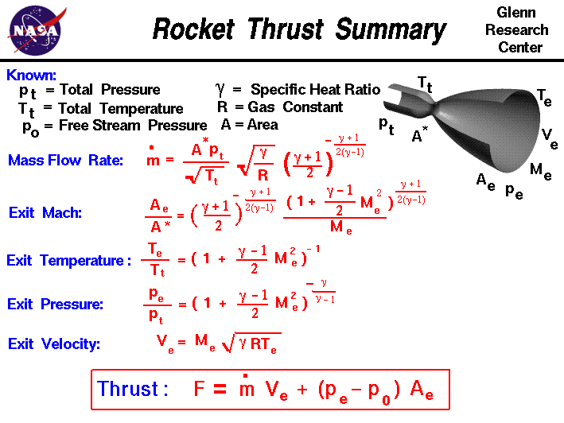

## Rocket Thrust Summary

Source: [NASA](https://www.grc.nasa.gov/WWW/BGH/rktthsum.html)

### Known Parameters:
- **pt** = Total Pressure
- **Tt** = Total Temperature
- **p0** = Free Stream Pressure
- **A*** = Throat Area
- **Ae** = Exit Area
- **&gamma;** = Specific Heat Ratio
- **R** = Gas Constant

### Calculated Parameters:
- **Me** = Exit Mach Number
- **Te** = Exit Temperature
- **pe** = Exit Pressure
- **Ve** = Exit Velocity
- **&dot;m** = Mass Flow Rate
- **F** = Thrust

### Key Equations:

#### Mass Flow Rate:
$$
\dot{m} = \frac{A^* p_t}{\sqrt{T_t}} \sqrt{\frac{\gamma}{R}} \left( \frac{\gamma + 1}{2} \right)^{-\frac{\gamma + 1}{2(\gamma - 1)}}
$$

#### Exit Mach Number:
$$
\frac{A_e}{A^*} = \left( \frac{\gamma + 1}{2} \right)^{-\frac{\gamma + 1}{2(\gamma - 1)}} \frac{\left(1 + \frac{\gamma - 1}{2} M_e^2 \right)^{\frac{\gamma + 1}{2(\gamma - 1)}}}{M_e} 
$$

#### Exit Temperature:
$$
\frac{T_e}{T_t} = \left( 1 + \frac{\gamma - 1}{2} M_e^2 \right)^{-1}
$$

#### Exit Pressure:
$$
\frac{p_e}{p_t} = \left( 1 + \frac{\gamma - 1}{2} M_e^2 \right)^{\frac{-\gamma}{\gamma - 1}}
$$

#### Exit Velocity:
$$
V_e = M_e \sqrt{\gamma R T_e}
$$

#### Thrust:
$$
F = \dot{m} V_e + (p_e - p_0) A_e
$$

## Input Fuel and Oxidizer

**Input Mass Flow Rate = Output Mass Flow Rate**

So:

**$\dot{m}$** = **$\dot{m}_{fuel}$** + **$\dot{m}_{oxidizer}$**

Where:
- **$\dot{m}$** is the Mass Flow Rate
- **$\dot{m}_{oxidizer}$** is the Mass Flow Rate of the oxidizer.
- **$\dot{m}_{fuel}$** is the Mass Flow Rate of the fuel.

Few people truly understand this simple rule. In a rocket, the input mass flow rate refers to the rate at which propellant is consumed and burned in the combustion chamber. The output mass flow rate is the rate at which exhaust gases are expelled through the nozzle. According to the conservation of mass, the input and output mass flow rates are equal, ensuring steady propulsion. This expelled mass creates thrust, propelling the rocket forward by Newton's third law of motion.

In rocket propulsion, the **oxidizer-to-fuel ratio (O/F)** is a critical parameter that defines the mass ratio between the oxidizer and the fuel. It determines the efficiency and performance of the combustion process. A proper balance of oxidizer and fuel ensures optimal combustion, providing the maximum thrust.

The **O/F ratio** is mathematically expressed as:

$$
\text{O/F} = \frac{m_{oxidizer}}{m_{fuel}}
$$

A higher O/F ratio means more oxidizer is used relative to fuel, and vice versa. Different rocket engines are optimized for specific O/F ratios based on the desired performance and fuel efficiency.

**Typical Oxidizer-to-Fuel Ratios (O/F)**

The table below lists the typical oxidizer-to-fuel ratios (O/F) for common rocket propellants:

| **Oxidizer**          | **Fuel**            | **O/F Ratio** (by mass) |
|-----------------------|---------------------|-------------------------|
| Liquid Oxygen (LOX)    | Liquid Hydrogen (LH2)| 5.5 - 6.0               |
| Liquid Oxygen (LOX)    | RP-1 (Kerosene)     | 2.56                    |
| Nitrogen Tetroxide (N2O4) | Hydrazine (N2H4)  | 1.6 - 2.0               |
| Nitrogen Tetroxide (N2O4) | UDMH             | 2.0 - 2.2               |
| Hydrogen Peroxide (H2O2) | Kerosene          | 7.0                     |
| Fluorine (F2)          | Liquid Hydrogen (LH2)| 4.0 - 4.5               |

The oxidizer-to-fuel ratio (O/F) is crucial for optimizing the combustion process in rocket engines. Each propellant combination has its own optimal O/F ratio to achieve maximum efficiency and thrust.

For other fuel and oxidizer combinations, the chemical stoichiometry must be determined. For example stoichiometry for LPG and liquid oxygen:

**Stoichiometry for LPG and Liquid Oxygen**

For the combustion of **Liquefied Petroleum Gas (LPG)**, which we will assume to be primarily **propane (C₃H₈)**, with **liquid oxygen (LOX)**, the stoichiometry can be solved as follows:

**Combustion Reaction**
The complete combustion of propane with oxygen is represented by the balanced chemical equation:

$$
\text{C}_3\text{H}_8 + 5\text{O}_2 \rightarrow 3\text{CO}_2 + 4\text{H}_2\text{O}
$$

**Mole Ratio**

From the balanced equation, 1 mole of propane reacts with 5 moles of oxygen.

**Mass Calculation**

To determine the mass of oxygen required to burn 1 mole of propane:

- Molar mass of propane **$\(\text{C}_3\text{H}_8\)$**:

$$
(3 \times 12) + (8 \times 1) = 44 \, \text{g/mol}
$$

- Molar mass of oxygen **$(\text{O}_2\)$**:

$$
2 \times 16 = 32 \, \text{g/mol}
$$

Thus, 1 mole of propane (44 g) requires 5 moles of oxygen, which is:

$$
5 \times 32 = 160 \, \text{g of oxygen}
$$

**Oxidizer-to-Fuel Ratio (O/F)**

The oxidizer-to-fuel ratio by mass is:

$$
\text{O/F} = \frac{\text{Mass of oxygen}}{\text{Mass of propane}} = \frac{160}{44} \approx 3.64
$$

Therefore, the **O/F ratio** for the combustion of propane with liquid oxygen is approximately **3.64** by mass.

This process can be applied to other components of LPG, like butane, by balancing the chemical equation and calculating the mass ratios similarly.

**Oxidizer-to-Fuel Ratios (O/F) for Various Fuels**

The table below lists the typical oxidizer-to-fuel ratios (O/F) for different fuels when combined with liquid oxygen and air. The O/F ratio is given by mass.

**With Liquid Oxygen (LOX)**

| **Fuel**          | **O/F Ratio** (by mass) |
|-------------------|-------------------------|
| Gasoline (Octane) | 15.7                    |
| Diesel Oil        | 14.6                    |
| Ethanol           | 3.67                    |
| Methanol          | 4.3                     |
| Methane           | 3.5                     |
| LPG (Propane)     | 3.64                    |

## Used Programming Languages 

- **C++**: A general-purpose programming language with object-oriented features, widely used for system/software development.
- **Fortran**: A language focused on numerical and scientific computing, known for its performance in mathematical calculations.
- **HTML**: A markup language used for creating and structuring web pages and web applications.
- **Kotlin**: A statically-typed language used primarily for Android development, known for its modern features and interoperability with Java.
- **MATLAB**: A high-level language and environment for numerical computing, visualization, and programming.
- **Pascal**: A procedural programming language designed for teaching programming and structured programming.
- **PHP**: A server-side scripting language used for web development and creating dynamic web pages.
- **Python**: A versatile, high-level programming language known for its readability and ease of use in various domains, including web development, data analysis, and artificial intelligence.
